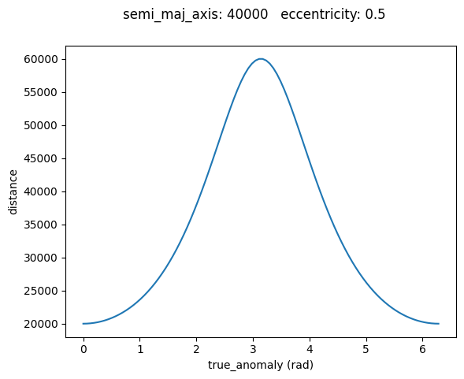
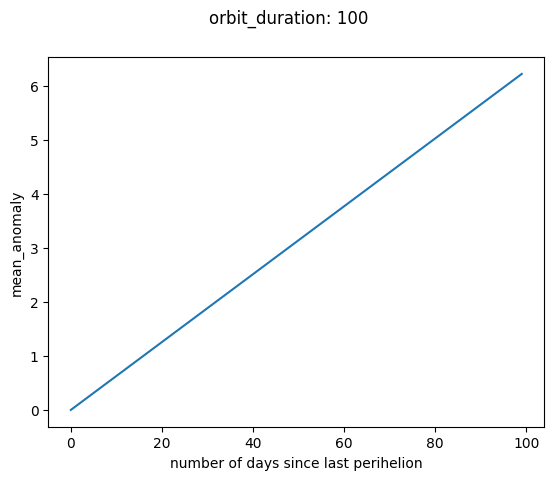
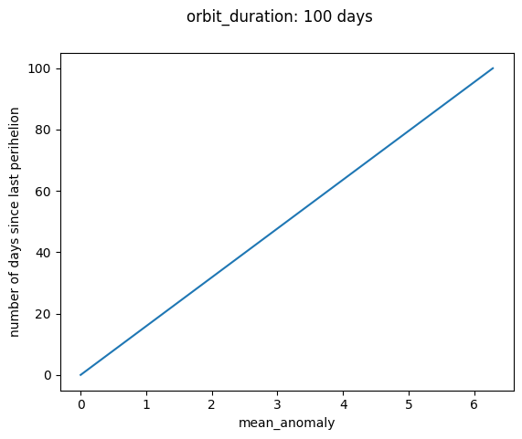
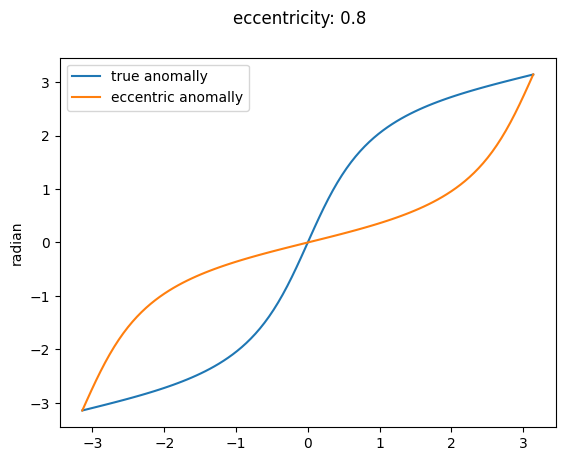

# orbit


<!-- WARNING: THIS FILE WAS AUTOGENERATED! DO NOT EDIT! -->

------------------------------------------------------------------------

<a
href="https://github.com/Tom-TBT/pyorbital/blob/main/pyorbital/orbit.py#L14"
target="_blank" style="float:right; font-size:smaller">source</a>

### distance

>      distance (true_anomaly, semi_maj_axis, eccentricity)

*true_anomaly: radians semi_maj_axis: ellipse’s semi major axis
eccentricity: ellipse’s eccentricity*

``` python
plt.figure()
plt.plot(np.linspace(0, np.pi*2, 100), distance(np.linspace(0, np.pi*2, 100), 40000, 0.5))
plt.xlabel("true_anomaly (rad)")
plt.ylabel("distance")
plt.suptitle(f"semi_maj_axis: {40000}   eccentricity: {0.5}")
```

    Text(0.5, 0.98, 'semi_maj_axis: 40000   eccentricity: 0.5')



``` python
assert distance(np.pi, 40000, 0.5) == 60000
assert distance(np.pi*2, 40000, 0.5) == 20000
assert distance(np.pi/4, 40000, 0.5) == 22163.883751087757
assert len(distance(np.arange(4568), 40000, 0.5)) == 4568  # Can provide true_anomaly as 1D array
```

------------------------------------------------------------------------

<a
href="https://github.com/Tom-TBT/pyorbital/blob/main/pyorbital/orbit.py#L31"
target="_blank" style="float:right; font-size:smaller">source</a>

### days_since_perihelion

>      days_since_perihelion (mean_anomaly, orbit_duration)

*days: number of days since last perihelion orbit_duration: duration of
an orbit in days*

------------------------------------------------------------------------

<a
href="https://github.com/Tom-TBT/pyorbital/blob/main/pyorbital/orbit.py#L24"
target="_blank" style="float:right; font-size:smaller">source</a>

### mean_anomaly

>      mean_anomaly (days, orbit_duration)

*days: number of days since last perihelion orbit_duration: duration of
an orbit in days*

``` python
plt.figure()
plt.plot(np.arange(100), mean_anomaly(np.arange(100), 100))
plt.xlabel("number of days since last perihelion")
plt.ylabel("mean_anomaly")
plt.suptitle(f"orbit_duration: {100} days")
```

    Text(0.5, 0.98, 'orbit_duration: 100')



``` python
plt.figure()
plt.plot(np.linspace(0, np.pi * 2, 100), days_since_perihelion(np.linspace(0, np.pi * 2, 100), 100))
plt.xlabel("mean_anomaly")
plt.ylabel("number of days since last perihelion")
plt.suptitle(f"orbit_duration: {100} days")
```

    Text(0.5, 0.98, 'orbit_duration: 100 days')



``` python
assert mean_anomaly(300.25, 686.97) * 180 / np.pi == 157.34311541988734
assert days_since_perihelion(np.pi, 100) == 50
```

------------------------------------------------------------------------

<a
href="https://github.com/Tom-TBT/pyorbital/blob/main/pyorbital/orbit.py#L48"
target="_blank" style="float:right; font-size:smaller">source</a>

### equation_of_center_true_anomally

>      equation_of_center_true_anomally (true_anomaly, eccentricity)

*Ec = trueAnomally - meanAnomally*

------------------------------------------------------------------------

<a
href="https://github.com/Tom-TBT/pyorbital/blob/main/pyorbital/orbit.py#L39"
target="_blank" style="float:right; font-size:smaller">source</a>

### equation_of_center_mean_anomally

>      equation_of_center_mean_anomally (mean_anomaly, eccentricity)

*Ec = trueAnomally - meanAnomally*

------------------------------------------------------------------------

<a
href="https://github.com/Tom-TBT/pyorbital/blob/main/pyorbital/orbit.py#L61"
target="_blank" style="float:right; font-size:smaller">source</a>

### eccentric_anomally_inv

>      eccentric_anomally_inv (true_anomally, eccentricity)

------------------------------------------------------------------------

<a
href="https://github.com/Tom-TBT/pyorbital/blob/main/pyorbital/orbit.py#L58"
target="_blank" style="float:right; font-size:smaller">source</a>

### true_anomally

>      true_anomally (eccentric_anomaly, eccentricity)

``` python
assert true_anomally(np.pi/4, 0.5) == 1.2446686345053115
assert eccentric_anomally_inv(1.2446686345053115, 0.5) == 0.7853981633974482  # almost pi/4
```

``` python
eccentricity = .8
plt.figure()
plt.plot(np.linspace(-np.pi, np.pi, 100), true_anomally(np.linspace(-np.pi, np.pi, 100), eccentricity), label="true anomally")
plt.plot(np.linspace(-np.pi, np.pi, 100), eccentric_anomally_inv(np.linspace(-np.pi, np.pi, 100), eccentricity), label="eccentric anomally")
plt.ylabel("radian")
plt.suptitle(f"eccentricity: {eccentricity}")
plt.legend()
```



------------------------------------------------------------------------

<a
href="https://github.com/Tom-TBT/pyorbital/blob/main/pyorbital/orbit.py#L67"
target="_blank" style="float:right; font-size:smaller">source</a>

### eccentric_anomally

>      eccentric_anomally (mean_anomally, eccentricity, precision=1e-06,
>                          method='newton-raphson')

*method: kepler or newton-raphson*
